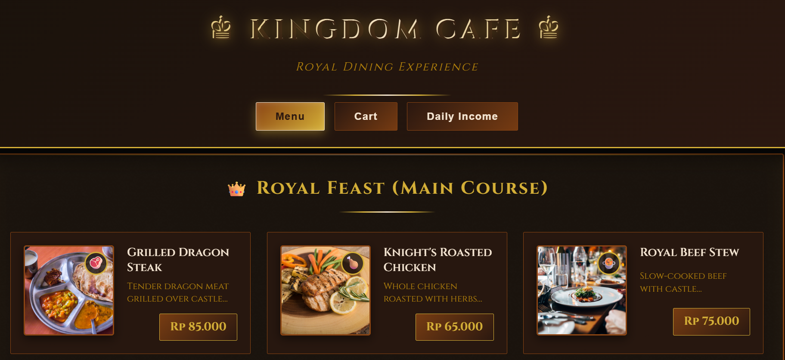

# 🍽 Smart Ordering System

Smart Ordering System is a web-based restaurant ordering application that allows users to browse menu items, add them to cart, and place orders digitally.

---

## 📌 Overview
This project is designed to simplify the ordering process in restaurants or cafes through a responsive and user-friendly web interface.

---

## ✨ Features
- Digital menu display
- Add to cart system
- Order summary page
- Responsive design
- Simple and clean UI

---

## 🛠 Tech Stack
- HTML
- CSS
- JavaScript
## 📸 Preview

---

## 🚀 Future Improvements
- User authentication
- Admin dashboard
- Database integration
- Payment gateway integration

## 📸 Preview

